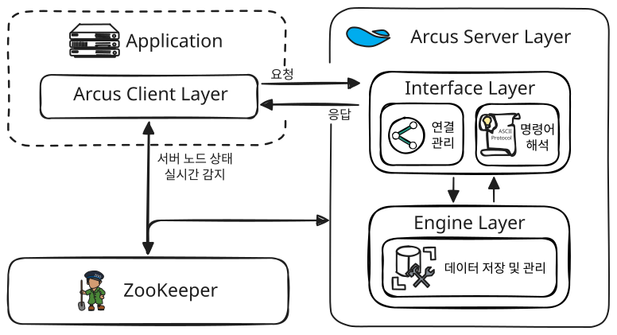

# 시스템 아키텍처

## 서버-클라이언트 구조

Arcus는 고성능 메모리 관리 엔진을 탑재한 서버와, 클러스터 동적 대응 기능을 갖춘 지능형 클라이언트로 구성됩니다.

### 서버 계층 (Server Layer)

서버는 요청된 명령을 처리하는 인터페이스 상단과 실제 메모리 저장을 관리하는 하단 엔진 계층으로 분리되어 있습니다.

#### 인터페이스 계층 (Interface Layer)

  - 클라이언트와의 TCP 연결을 수립하고 통신 상태를 유지 및 관리
  - 클라이언트가 전송한 ASCII 프로토콜 기반의 명령어를 파싱(Parsing)하고 해석
  - 해석된 명령어를 하단 엔진 계층(Engine Layer)이 처리할 수 있도록 전달하고 흐름을 제어
  - 엔진 계층에서 완료된 처리 결과를 다시 ASCII 프로토콜 기반의 응답 메시지로 변환하여 클라이언트에게 반환

#### 엔진 계층 (Engine Layer)

다양한 저장 엔진을 선택하여 사용할 수 있는 **플러그형 엔진 구조**를 채택하고 있습니다. 
현재 제공 중인 엔진 종류는 아래와 같습니다.

**Default Engine**
  - 메모리를 고정 크기(Slab) 단위로 미리 할당받아 관리하는 슬랩 할당자(Slab Allocator)를 내장
  - 데이터 저장 시 OS에 매번 메모리를 요청하지 않고 내부적으로 공간을 재사용하여 시스템 부하를 최소화하고 빠른 응답 속도를 유지

### 클라이언트 계층 (Client Layer)

애플리케이션 환경에 맞춰 다양한 언어의 라이브러리를 제공하며, ZooKeeper와 연동하여 서버 노드 상태를 실시간으로 감지하고 데이터를 분산 요청합니다. 상세한 가이드는 아래 각 클라이언트 문서를 확인하시기 바랍니다.

- [Arcus Java Client](../../arcus-java-client/)
- [Arcus C Client](../../arcus-c-client/)

## ZooKeeper 기반 동적 노드 관리

Arcus는 ZooKeeper를 클러스터 구성을 위한 중앙 메타데이터 저장소로 사용합니다. 클러스터에 참여하는 모든 서버와 클라이언트는 ZooKeeper에 기록된 메타데이터를 기준으로 동작하며, 이를 통해 전체 시스템의 일관성을 보장합니다. 상세한 가이드는 아래 문서를 확인하시기 바랍니다.

- [Arcus Cluster](../../arcus-cluster/)
