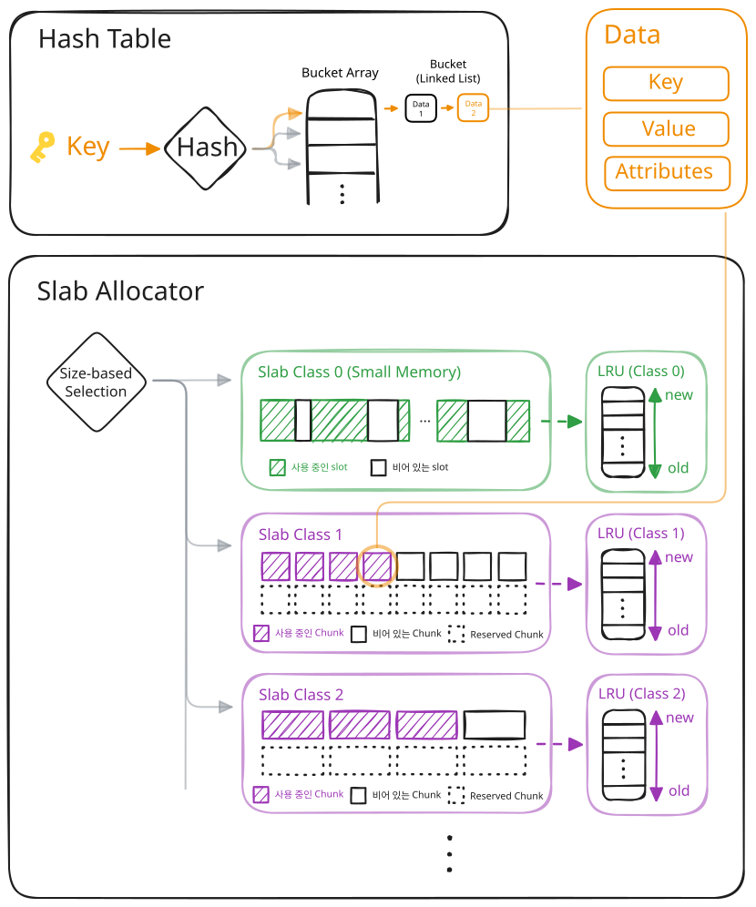

# Default Engine

## 개요

Default Engine은 Arcus Memcached의 기본 저장 엔진으로, 데이터를 메모리에 저장하고 조회·삭제·관리하는 역할을 수행합니다.
내부적으로는 빠른 조회를 위한 Hash Table 구조와, 메모리 사용 효율을 높이기 위한 Slab 기반 메모리 할당 방식을 사용합니다.

## Hash Table

Default Engine은 데이터를 빠르게 조회하기 위해 Hash Table 구조를 사용합니다.

데이터를 저장할 때는 Key에 Hash 함수를 적용하여 Bucket Array 내의 Bucket 위치를 계산합니다.
계산된 Bucket에는 Linked List 형태로 데이터가 연결되어 저장되며, 동일한 Bucket 위치로 계산된 데이터들은 하나의 Linked List에서 함께 관리됩니다.

데이터를 조회할 때도 동일한 방식으로 Bucket 위치를 계산한 뒤, 해당 Bucket의 Linked List에서 Key를 비교하여 원하는 데이터를 찾습니다.

## Slab 할당자

Default Engine은 메모리를 효율적으로 사용하기 위해 Slab 기반 메모리 할당 방식을 사용합니다.

메모리는 여러 개의 Slab Class로 나누어 관리되며, 각 Slab Class는 동일한 크기의 Chunk들로 구성됩니다.
Slab Class는 0부터 시작하며, 작은 번호의 Slab Class일수록 더 작은 크기의 Chunk를 관리합니다.

데이터 저장 시에는 데이터 크기에 맞는 Chunk 크기를 가지는 Slab Class가 선택되며, 해당 Class의 Chunk 공간에 데이터가 저장됩니다.

### Reserved Chunk

Reserved Chunk는 `memory_limit`에 도달한 상황에서도 최소한의 메모리 공간을 사용할 수 있도록 예약된 Chunk 영역입니다.
메모리 부족 상황에서도 일부 데이터 처리에 필요한 최소 공간을 확보하기 위해 사용됩니다.

### SM(Small Memory) 할당자

컬렉션 타입 데이터는 내부적으로 여러 개의 작은 메모리 조각 단위로 구성됩니다.
컬렉션 요소와 내부 노드는 크기 편차가 크고, 작은 메모리 할당이 자주 발생하기 때문에 일반적인 고정 크기 Chunk 기반 할당 방식만으로는 메모리 사용 효율이 낮아질 수 있습니다.

이를 보완하기 위해 Slab Class 0은 SM(Small Memory) 할당자로 사용됩니다.
SM 할당자는 약 48KB 이하의 작은 데이터를 관리하며, 다른 Slab Class와 달리 고정 크기 Chunk 대신 가변 크기 Slot 기반으로 메모리를 할당합니다. 컬렉션의 내부 요소뿐만 아니라 48KB 이하의 일반 데이터도 이 영역에 저장됩니다.

### LRU(Least Recently Used) 리스트

LRU 리스트는 데이터의 최근 사용 순서를 관리하기 위한 구조입니다. 각 Slab Class별로 독립적인 LRU 리스트를 유지하며, 최근에 접근한 데이터는 리스트의 앞쪽으로 이동하고 오랫동안 사용되지 않은 데이터는 뒤쪽으로 이동합니다.

데이터 축출(Eviction) 기능이 활성화된 상태에서 저장 공간이 부족해지면, LRU 리스트의 뒤쪽부터 제거 가능한 데이터를 탐색합니다. 이 과정에서는 먼저 만료(Expired)된 데이터를 우선적으로 정리합니다.
만료된 데이터가 없으면 가장 오랫동안 사용되지 않은 데이터를 제거합니다.

단, 제거 대상 데이터가 현재 다른 요청에서 사용 중인 경우에는 다음 후보 데이터를 탐색합니다.
끝까지 제거 가능한 데이터를 찾지 못하면 OOM(Out Of Memory) 오류를 반환합니다.
