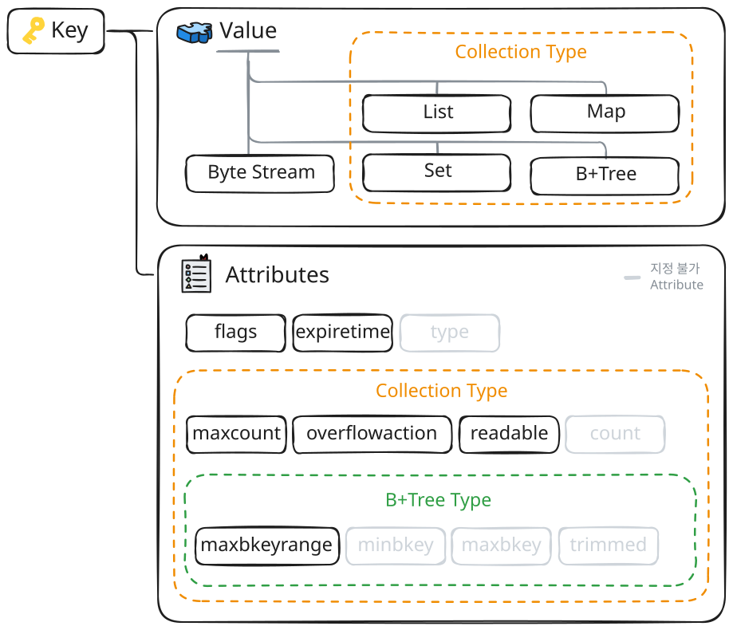

# 데이터 모델

## 구성 요소

Arcus Memcached에서는 데이터를 효율적으로 식별하고 제어하기 위해 **Key**, **Value**, **Attributes**라는 세 가지 핵심 요소로 데이터를 관리합니다.



## Key

데이터를 저장하고 조회하기 위한 **유일한 식별자**입니다.

```regex
[<prefix><delimiter>]<subkey>
```

- `<prefix>` (선택) : 데이터를 목적이나 서비스 단위로 논리적으로 그룹화하기 위한 식별 영역
- `<delimiter>` (선택) : prefix와 subkey를 나누는 사전에 정의된 구분자(기본값 `:`)
- `<subkey>` (필수) : 개별 데이터를 식별하기 위해 사용하는 실제 고유 코드

Key의 전체 길이는 최대 16,000자까지 허용되며, 공백 및 `\r`, `\n`을 포함할 수 없습니다.

## Value

Key와 매핑되어 실제로 메모리에 저장되는 데이터의 실체입니다. Arcus Memcached에서는 사용 목적에 따라 두 가지 저장 모델을 제공합니다.

### 단일 데이터 모델 (Key-Value)
  - 하나의 Key에 하나의 데이터 객체를 1:1로 대응하여 저장하는 기본 모델입니다.
  - 텍스트, 이미지, 직렬화된 객체 등 모든 데이터를 **바이트 스트림(Byte Stream)** 형태로 변환하여 저장합니다.

### 구조화된 데이터 집합 모델 (Collection)
  - 하나의 Key 아래에 다수의 데이터 요소(Element)를 특정 자료구조(List, Set, Map, B+Tree) 형태로 묶어 저장하는 확장 모델입니다.
  - 컬렉션에 관한 자세한 사항은 해당 [컬렉션](02-컬렉션.md) 문서를 확인하시기 바랍니다.

## Attributes

데이터의 만료 시간, 접근 제어, 용량 정책 등을 결정하는 메타데이터입니다.

> 컬렉션 타입의 일부 속성에 대한 상세한 가이드는 [컬렉션](./02-컬렉션.md) 문서를 확인하시기 바랍니다.

| 속성 | 대상 | 설명 |
| :--- | :--- | :--- |
| **type** | 공통 | 데이터의 구조 형태 (Key-Value, List, Set, Map, B+Tree) |
| **flags** | 공통 | 사용자가 데이터와 함께 저장하고 조회 시 그대로 반환받는 임의의 32비트 부호 없는 정수 |
| **expiretime** | 공통 | 데이터 만료 시간 설정 (단위: 초). <br>• **2,592,000(30일) 이하**: 설정한 시간(초) 경과 후 만료<br>• **2,592,000 초과**: [Unix Timestamp](https://www.unixtimestamp.com/) 지정 시각에 만료<br>• **0**: 무기한 저장 (단, 메모리 부족 시 LRU 알고리즘에 의해 자동 제거 가능) |
| **count** | Collection | 컬렉션에 저장된 현재 요소 개수 |
| **maxcount** | Collection | 하나의 컬렉션에 저장 가능한 최대 요소 개수<br> (기본 4,000개) |
| **overflowaction** | Collection | `maxcount` 초과 시 동작 정책<br> (에러 반환 또는 정책에 따른 기존 요소 자동 삭제) |
| **readable** | Collection | 컬렉션 데이터의 조회 가능 여부를 결정하는 상태 값 |
| **minbkey** | B+Tree | B+Tree에 저장된 가장 작은 BKey 값 |
| **maxbkey** | B+Tree | B+Tree에 저장된 가장 큰 BKey 값 |
| **maxbkeyrange** | B+Tree | BKey의 최대 허용 범위를 제한하는 속성 |
| **trimmed** | B+Tree | B+Tree에서 `overflowaction`으로 인한 자동 요소 제거로 인한 Trim 영역 발생 여부 |
