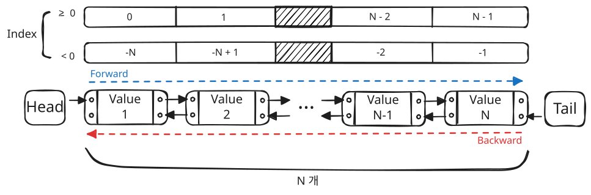
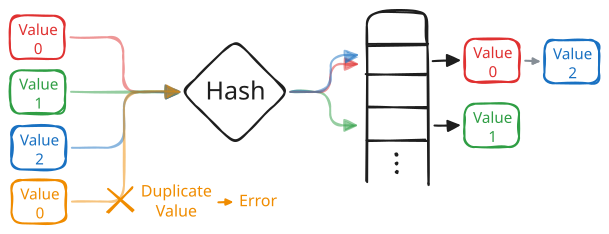
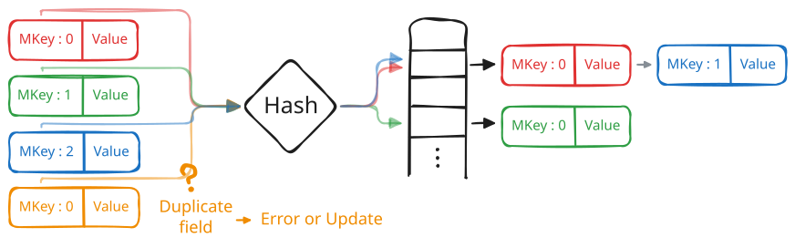
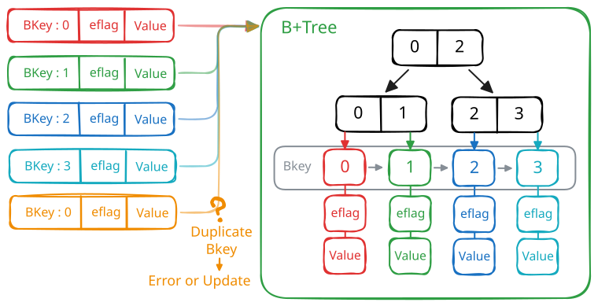

# 컬렉션(Collection)

## 구성 요소

Arcus Memcached는 서비스 요구사항에 맞춰 최적의 성능을 낼 수 있도록 4가지 컬렉션 타입을 제공합니다.

컬렉션을 구성하는 각 요소(Element)는 단 하나의 값(Value)을 가지며, 이러한 컬렉션은 시스템 부하를 방지하고 데이터를 안전하게 제어하기 위해 다음과 같은 속성(Attributes)을 갖습니다.

### 최대 저장 개수 (Maxcount)

- 단일 컬렉션에 보관할 수 있는 요소(Element)의 최대 개수를 정의합니다.
- 한 번에 과도한 데이터가 처리되어 시스템 전체의 성능이 저하되는 것을 사전에 방지합니다.
- 기본 설정값은 4,000개이며, 최대 허용치(Hard Limit)는 50,000개입니다.

### 용량 초과 시 동작 (Overflowaction)

- 컬렉션에 저장된 요소가 최대 저장 개수(Maxcount)에 도달했을 때, 새로운 요소의 처리 방식을 결정합니다.
- 컬렉션 타입에 따라 지원하는 처리 정책과 기본 동작이 다르게 적용됩니다.

### 조회 가능 여부 (Readable)

- 컬렉션에 대한 데이터 조회 허용 상태(on/off)를 설정합니다.
- 컬렉션 준비가 완료될 때까지 조회를 차단하여 데이터의 일관성을 보장합니다.
- 기본 설정값은 on입니다.

## List

요소들이 순서대로 일렬로 나열된 양방향 연결 리스트(Doubly Linked List) 구조입니다.
특정 인덱스를 지정하여 어느 위치에서나 요소의 삽입, 조회, 제거가 가능합니다.

### 인덱스(Index)

리스트 내 요소의 위치를 나타내는 정수형 식별자입니다.
- `0`부터 시작하며, `-1`과 같은 음수를 사용해 리스트의 끝에서부터 역순으로 위치를 지정할 수 있습니다.
- 요소의 삽입 및 제거에 따라 나머지 요소들의 인덱스가 자동으로 조정됩니다.

> [!WARNING] ⚠️ 주의 사항
> 인덱스 접근 시 내부적으로 순차 탐색(Sequential Search)을 수행합니다.
> 따라서 요소 개수가 많을수록 중간 위치의 요소를 처리하는 시간이 늘어날 수 있습니다.

### List Overflowaction

- `tail_trim` (기본값) : 리스트의 가장 끝의 요소를 제거하고, 새로운 요소를 추가
- `head_trim` : 리스트의 맨 앞의 요소를 제거하고, 새로운 요소를 삽입
- `error` : 새로운 요소의 삽입을 거부하고 에러를 반환

## Set

순서가 없고 유일한 값(Unique Value)들로 구성된 집합 구조입니다.
이미 존재하는 값을 삽입할 경우 중복으로 판단하여 에러를 반환합니다.

### Set Overflowaction

- `error` (기본값) : 새로운 요소의 삽입을 거부하고 에러를 반환

## Map

MKey와 값(Value)을 쌍으로 저장하며, MKey를 식별자로 사용하는 구조입니다.
이미 존재하는 필드에 삽입을 시도할 경우, 사용자의 선택에 따라 에러를 반환하거나 기존 데이터를 새로운 값으로 업데이트할 수 있습니다.

### MKey (Map Key)

Map 내에서 개별 요소를 구분하고 접근하기 위한 고유 식별자입니다. (최대 250자)

### Map Overflowaction

- `error` (기본값) : 새로운 요소의 삽입을 거부하고 에러를 반환

## B+Tree

각 요소마다 고유한 BKey를 가지며, 이를 기준으로 상시 정렬된 상태를 유지하는 구조입니다.
정렬된 상태를 활용하여 특정 범위 내의 요소들을 추출하는 범위 검색(Range Scan)이 가능합니다.

### BKey (B+Tree Key)

B+Tree 내에서 요소의 저장 위치와 정렬 순서를 결정하는 식별자입니다.

이 키를 기준으로 데이터가 상시 정렬되며, 특정 BKey를 지정해 원하는 요소에 직접 접근하거나 일정 범위의 데이터들을 한 번에 조회할 수 있습니다.

BKey로 사용할 수 있는 타입은 다음 두 가지이며, 하나의 B+Tree 내 모든 요소는 동일한 타입의 BKey를 사용해야 합니다.

- **8 Bytes Unsigned Integer (권장)**
  - 0 ~ 18446744073709551615 범위의 정수
  - 단순한 숫자 크기로 대소를 비교합니다.

- **Hexadecimal**
  - `0x`로 시작하는 짝수 길이의 16진수 문자열 (대소문자 무관)
  - 두 개의 16진수 문자를 1 Byte로 취급하여 저장 (최대 31바이트 길이)
  - 첫 바이트부터 차례대로 사전순(Lexicographical) 비교를 수행하며, 비교 가능한 위치까지 모두 동일하다면 길이가 더 긴 값이 크다고 판단

### EFlag (Element Flag)

B+Tree 컬렉션 요소에 추가로 부여하는 Flag 값입니다.
요소 조회 시 비트 연산이나 비교 연산을 통해 특정 조건을 만족하는 요소만 추출하는 필터링 기능을 제공합니다.

EFlag로 사용할 수 있는 데이터 타입은 다음과 같습니다.

- **Hexadecimal**
  - `0x`로 시작하는 짝수 길이의 16진수 문자열 (대소문자 무관)
  - 두 개의 16진수 문자를 1 Byte로 취급하여 저장합니다. (최대 31바이트 길이)

EFlag에 대하여 지원하는 연산은 다음과 같습니다.

- **비트 연산(Bitwise Operation)**
  - 지원 연산자 : `&` (AND), `|` (OR), `^` (XOR)
  - EFlag를 가공하거나 특정 부분만 추출할 때 사용합니다.
  - 조회 시 비교 연산을 수행하기 전 필요한 비트 패턴만 걸러내거나, 데이터 업데이트 시 특정 부분만 수정할 목적으로 활용합니다.

- **비교 연산(Comparison Operation)**
  - 지원 연산자: `EQ`(=), `NE`(≠), `LT`(<), `LE`(≤), `GT`(>), `GE`(≥)
  - EFlag 값을 기준으로 크기나 일치 여부를 비교하여 특정 조건을 만족하는 요소만 필터링합니다.

- **다중 값 비교(IN / NOT IN Operation)**
  - 지원 연산자: `IN` (포함), `NOT IN` (미포함)
  - 사용자가 지정한 값 목록(최대 100개) 중에서 요소의 EFlag 값과 일치하는 값이 있는지 확인하여 필터링합니다.

> [!WARNING] ⚠️ 주의 사항
>
> 안정적인 필터링을 위해 하나의 B+Tree 컬렉션 내에서는 동일한 길이의 EFlag를 사용하는 것을 권장합니다.

> [!INFO] 🔎 참고 사항
>
> 아래 두 경우에는 EFlag를 비교할 수 없어 조건 불일치로 처리됩니다. 단, `NE` 조건은 예외적으로 일치로 처리됩니다.
> - 검색 대상 요소에 EFlag가 없음
> - 비교하려는 값이 실제 EFlag보다 긴 경우

### B+Tree Overflowaction

- `smallest_trim` (기본값) : BKey가 가장 작은 요소를 제거하고 새로운 요소를 추가
- `largest_trim` : BKey가 가장 큰 요소를 제거하고 새로운 요소를 추가
- `error` : 새로운 요소의 삽입을 거부하고 에러를 반환
- `smallest_silent_trim` : `smallest_trim`과 동일하게 동작하나, Trim 발생 여부를 알려주지 않음
- `largest_silent_trim` : `largest_trim`과 동일하게 동작하나, Trim 발생 여부를 알려주지 않음

### Trim

Overflowaction에 의해 BKey 기준으로 한쪽 끝의 요소가 자동 제거되었음을 기록하는 상태입니다. 이때 제거된 구간, 즉 현재 저장된 끝 요소의 BKey보다 바깥쪽 영역을 **Trim 영역**이라 합니다.

Trim을 통해 단순히 데이터가 없는 상태와 용량 초과로 인해 제거된 상태를 구분할 수 있습니다.
이를 통해 Arcus Memcached에서 데이터를 찾지 못했을 때, DB를 추가로 조회해야 할지 판단하는 근거가 됩니다.

### Maxbkeyrange

B+Tree 내 BKey가 가질 수 있는 범위, 즉 가장 큰 BKey와 가장 작은 BKey의 차이를 제한합니다. 기본값은 `0`으로 범위 제한 없음을 의미하며, 범위를 제한하려면 대상 B+Tree의 BKey와 동일한 데이터 타입으로 `1(0x1)` 이상의 값을 지정합니다.

범위가 설정된 상태에서 새로운 요소를 삽입해 BKey 범위가 Maxbkeyrange를 초과하면, Overflowaction 정책에 따라 범위를 벗어난 기존 요소들이 제거되거나 삽입에 실패합니다. 이때 요소가 제거되더라도 Trim으로 처리하지 않습니다.

Maxbkeyrange는 BKey가 타임스탬프나 순번처럼 증가하는 값일 때, 오래된 요소를 밀어내고 최신 구간만 유지하는 용도로 사용할 수 있습니다. 예를 들어 BKey가 타임스탬프이고 Maxbkeyrange를 1시간으로 설정하면 B+Tree에는 최근 1시간의 데이터만 남아있게 됩니다.